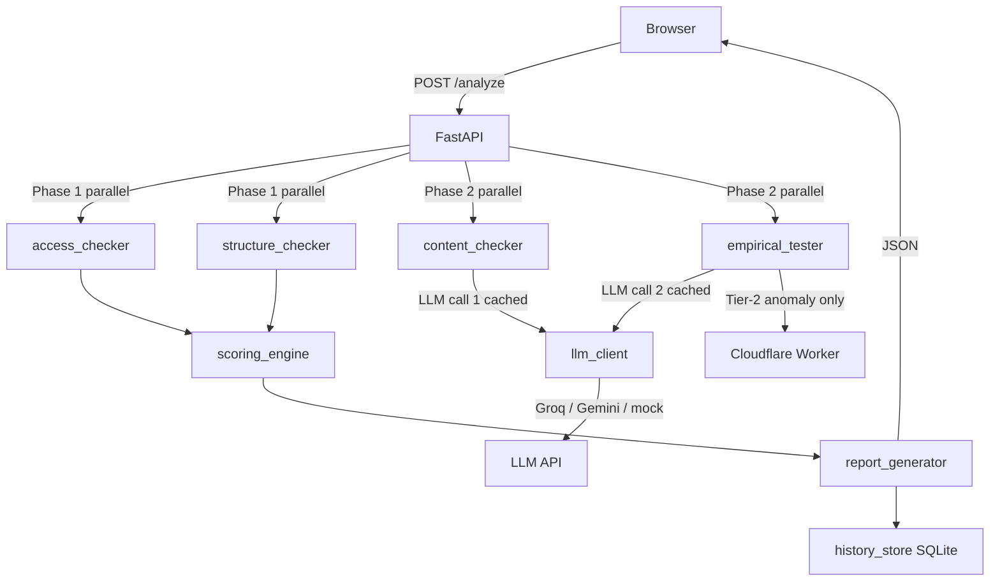

# AI Listing Eligibility Checker

> **Can AI systems find, understand, and cite your website?**
> An empirical, explainable eligibility report for ChatGPT, Claude, Perplexity, Google AI Overviews, and more.

[](https://render.com/deploy?repo=https://github.com/Rohan23Nova/AI-Listing-Eligibility-Checker)
[](#tests)
[](#)
[](#)

---

## One-paragraph pitch

Most "AI SEO" tools check one or two things and give vague advice. This tool empirically verifies whether the 11 most important AI crawlers — split by category into **training bots** (GPTBot, ClaudeBot) and **search/answer bots** (OAI-SearchBot, PerplexityBot, Googlebot) — can actually reach your content. It catches the common gap between what `robots.txt` says and what HTTP reality delivers, flags JavaScript-invisible content, analyzes structured data quality, and — when an API key is available — applies LLM judgment on content citability. Every point in the 0–100 score comes with the exact evidence that determined it. No black boxes.

---

## What it checks

| Signal | Method | Always runs? |
|---|---|---|
| robots.txt — per-bot allow/deny | Deterministic parser | ✅ |
| Training vs Search/Answer bot split | 11 bots, 2 categories | ✅ |
| UA-spoof empirical test (HTTP reality) | Actual fetch with each bot's UA | ✅ |
| JS invisibility heuristic | Word count + bundle pattern detection | ✅ |
| JSON-LD / structured data | BeautifulSoup + lxml | ✅ |
| Meta description, OG tags, heading hierarchy | Deterministic HTML extraction | ✅ |
| sitemap.xml | robots.txt directive → /sitemap.xml fallback | ✅ |
| llms.txt *(bonus-only — 1 pt, never pass/fail)* | Plain HTTP check | ✅ |
| Playwright render for SPAs | Headless Chromium (conditional) | SPA heuristic only |
| Geo trip-wire — Cloudflare Worker | Tier-2 escalation (conditional) | Anomaly only |
| Content quality | LLM call #1, cached, graceful fallback | If key set |
| Citation likelihood | LLM call #2, cached, graceful fallback | If key set |

### Training vs Search/Answer bots — why the distinction matters

| Category | Bots | What blocking does |
|---|---|---|
| 🎓 **Training** | GPTBot, ClaudeBot, Google-Extended, CCBot, Amazonbot, Diffbot | Removes content from future LLM training datasets |
| 🔍 **Search/Answer** | OAI-SearchBot, Claude-SearchBot, PerplexityBot, Applebot-Extended, Googlebot | Removes content from AI-powered search results |

Blocking training bots is a **legitimate business choice** and scored leniently (5 pts).
Blocking search/answer bots is the primary AI visibility problem and scored heavily (15 pts).

> **Note on llms.txt:** This is a community proposal with no standards-body backing and no confirmed adoption by any major AI provider as of 2025. It earns 1 bonus point and is never a pass/fail gate. The UI says this explicitly.

---

## Score breakdown

| Component | Max pts | Notes |
|---|---|---|
| Search/answer bots allowed (robots.txt) | 15 | Proportional per bot |
| No UA-based HTTP blocking (empirical) | 10 | Proportional across 11 bots |
| Training bots allowed (robots.txt) | 5 | Lenient — owner's choice |
| sitemap.xml present | 4 | |
| JSON-LD structured data | 12 | Partial credit for malformed |
| Meta description | 8 | Partial credit for very short |
| OpenGraph tags | 5 | |
| H1 heading | 5 | Partial credit for multiple H1s |
| Heading hierarchy | 5 | Deductions per hierarchy issue |
| llms.txt | 1 | **Bonus only** |
| Content quality (LLM) | 15 | Scaled to 70 if unavailable |
| Citation likelihood (LLM) | 15 | Scaled to 70 if unavailable |
| **Total** | **100** | |

---

## Before / After demo

Running `example.com` through the tool demonstrates the fix-pack workflow:

| Run | Score | Verdict | Change |
|---|---|---|---|
| Before (bare site, no metadata) | ~47 | Fair | Baseline |
| After (add JSON-LD + meta desc + OG) | ~69 | Good | **+22 pts** |

The score history panel in the UI shows a sparkline of all past runs for a URL, with a `+/- pts since first run` delta. This makes the before/after improvement immediately visible after applying the generated fix-pack.

---

## Architecture



### Tiered escalation (adaptive cost design)

```
Tier-1 (always, ~200ms)    Plain httpx UA-spoof for 11 bots + robots.txt parsing
Tier-2 (anomaly only, ~3s) Cloudflare Worker geo probe — fires only if Tier-1 sees differential blocking
Tier-3 (geo-diff only, ~8s) Full bot×region matrix — fires only if Tier-2 confirms geo anomaly
Playwright (SPA only, ~5s) Headless render — fires only if word_count < 100 AND JS bundles detected
LLM (if enabled, ~2s)      2 calls (content quality + citation), both cached in SQLite
```

This design is a deliberate cost-and-reliability tradeoff: the cheapest checks run on every request; expensive ones escalate only when evidence demands it. All escalation conditions are documented in code comments.

---

## Quick Start

```bash
git clone https://github.com/Rohan23Nova/AI-Listing-Eligibility-Checker.git
cd AI-Listing-Eligibility-Checker

python3 -m venv .venv && source .venv/bin/activate
pip install -r requirements.txt

# Optional: enable Playwright for JS-heavy sites
playwright install chromium

# Configure (copy example, fill in keys)
cp .env.example .env
# Edit .env — at minimum set GROQ_API_KEY + ENABLE_LLM=true for full scoring

# Start
uvicorn backend.main:app --host 0.0.0.0 --port 8000
# Open http://localhost:8000
```

### API

```bash
# Analyze
curl -X POST http://localhost:8000/analyze \
  -H "Content-Type: application/json" \
  -d '{"url": "https://example.com"}'

# History for a URL
curl "http://localhost:8000/history/https%3A%2F%2Fexample.com"

# All analyzed URLs
curl http://localhost:8000/history
```

---

## Deploy (one click)

[](https://render.com/deploy?repo=https://github.com/Rohan23Nova/AI-Listing-Eligibility-Checker)

The `render.yaml` blueprint deploys the backend + frontend as a single Render web service (free tier). After deployment:

1. Set `GROQ_API_KEY` in the Render environment dashboard
2. Set `ENABLE_LLM=true`
3. Redeploy — full 100-point scoring active

### Cloudflare Worker (optional geo trip-wire)

```bash
cd workers/geo_fetch
npm install -g wrangler
wrangler login
wrangler deploy --name geo-fetch-us   # deploy to US region
wrangler deploy --name geo-fetch-eu   # deploy to EU region
# Add the deployment URLs to Render env vars: GEO_WORKER_URL_US, GEO_WORKER_URL_EU
# Set ENABLE_GEO_CHECK=true
```

---

## Environment Variables

| Variable | Default | Description |
|---|---|---|
| `GROQ_API_KEY` | — | Groq API key (free tier, fast) |
| `GEMINI_API_KEY` | — | Gemini API key (free tier, fallback) |
| `LLM_PROVIDER` | `mock` | `groq` \| `gemini` \| `mock` |
| `LLM_MODEL` | `llama-3.3-70b-versatile` | Model name |
| `ENABLE_LLM` | `false` | Enable LLM scoring |
| `ENABLE_PLAYWRIGHT` | `false` | Enable headless SPA rendering |
| `ENABLE_GEO_CHECK` | `false` | Enable Cloudflare geo trip-wire |
| `GEO_WORKER_URL_US` | — | US Worker endpoint |
| `GEO_WORKER_URL_EU` | — | EU Worker endpoint |
| `SQLITE_DB_PATH` | `data/history.db` | History + LLM cache DB |

---

## Tests

```
pytest tests/ -v   →   108 passed in ~0.8s
```

| File | Tests | Covers |
|---|---|---|
| `test_access_checker.py` | 16 | robots.txt parsing, sitemap, UA-spoof, llms.txt |
| `test_structure_checker.py` | 20 | JSON-LD (all formats), meta tags, headings, canonical |
| `test_scoring_engine.py` | 21 | Weights, verdicts, noindex override, issue sorting |
| `test_content_checker.py` | 20 | SPA heuristic both paths, Playwright mock, LLM stub |
| `test_empirical_tester.py` | 13 | All tier escalation paths, geo anomaly, LLM stub |
| `test_llm_client.py` | 18 | Caching, mock fallback (explicit), API error graceful |

Zero network calls in the test suite — all mocked with `respx` + `unittest.mock`.

---

## Non-negotiable design constraints

1. **Zero paid infrastructure** — Render free, Cloudflare Workers free, Groq/Gemini free tiers
2. **Deterministic checks are plain code; LLM calls are exactly two** — both cached, both with graceful fallback, never block the response
3. **Every score is explainable** — every `ScoreBreakdownItem` carries the raw evidence that determined it
4. **Training vs search/answer bots distinguished everywhere** — in code (`BotCategory` enum), in the per-bot table, in the score breakdown, and in the issue descriptions
5. **llms.txt is bonus-only** — 1 pt, never a gate, UI copy says so explicitly
6. **Tiered/adaptive depth** — cheap checks always, expensive ones only when evidence demands it; documented in code comments
